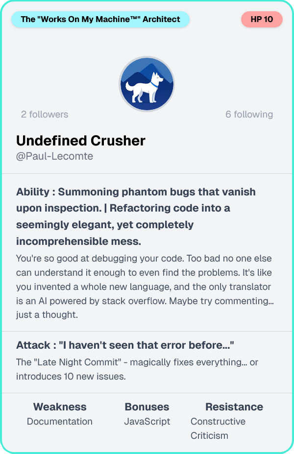

<!-- PROJECT TITLE & BADGES -->
<p align="center">
  
</p>
<h1 align="center">github_roasting</h1>
<p align="center">
  <strong> Roasting GitHub repos for fun and laughter</strong><br>
  <a href="https://github.com/Paul-Lecomte/github_roasting/stargazers">
    
  </a>
  
  
  
  
</p>

---

##  What is github_roasting?
**github_roasting** is a fun little tool that analyzes a GitHub profile or repository and returns a witty roast. It’s a side project built with love in TypeScript, leveraging the GitHub API to generate light-hearted commentary based on your public data.
<p align="center">
  
</p>

---

##  Features

-  Roast any GitHub user
-  AI-generated personality insights based on repo activity
-  Modular, easy-to-extend architecture (Next.js + TypeScript)
-  Simple, responsive UI with TailwindCSS

---

##  Tech Stack

- ️ **Framework**: Next.js (App Router)
-  **Language**: TypeScript
-  **Styling**: TailwindCSS
-  **Data**: GitHub REST API
-  **AI used**: Gemini-2.0-flash API - with custom prompts

---

## Project Structure

```bash
github_roasting/
├── src/                      # Source code (frontend + logic)
│   ├── app/                  # Next.js App Router
│   │   ├── api/              # API endpoints (e.g. /api/roast)
│   │   ├── generate-roast/   # Main landing page
│   │   │   └── route.ts      # API route for roasting
│   │   ├── layout.tsx        # Layout for the app
│   │   └── page.tsx          # Main landing page
│   ├── components/           # UI components (Card, Input, RoastOutput…)
│   │   ├── RoastCard.tsx
│   │   └── UsernameForm.tsx
│   ├── lib/                  # GitHub API calls & roast engine
│   │   └── github.ts
│   └── styles/               # TailwindCSS config / global CSS
│       └── globals.css
├── public/                   # Static assets (images, favicon)
├── .gitignore                # Ignored files
├── next.config.js            # Next.js config
├── package.json              # Project metadata & dependencies
├── tsconfig.json             # TypeScript configuration
├── README.md                 # Project overview & instructions
└── LICENSE                   # MIT license file

```

---

## Getting Started


## Clone the repo
```bash
git clone https://github.com/Paul-Lecomte/github_roasting.git
```

```bash
cd github_roasting
```

## Install dependencies
```bash
npm install
```

## .env file
Create a `.env` file in the root directory and add your Gemini API token:
```dotenv
GEMINI_API_KEY=your_gemini_api_key_here
```


## Run locally
```bash
npm run dev
```
Then open [http://localhost:3000](http://localhost:3000) in your browser.

---

## Usage

Enter a GitHub username and click **“Roast Me”**.  
The app fetches public repo data and uses roast templates to generate a humorous output.

Roast levels:
- `light`: Friendly teasing
- `mild`: A little sting
- `spicy`: Brutally honest (but still funny)

---

## Customization

You can:
- Modify templates in `/app/api/generate-roast/route.ts`
- Add new UI features or API endpoints

---

## Roadmap

- [x] Add user profile roasting
- [x] Three roast modes: `light`, `mild`, and `spicy`
- [x] Improve template variation with GPT-style prompts
- [x] Save card as a image (PNG)
- [ ] Add other options like nice card or funny card
- [ ] Add support for GitLab and Bitbucket

---

## Acknowledgements

This project was built for fun and practice. Inspired by friends who commit weird stuff and push at 2am.

Huge shout-out to:
- GitHub REST API
- Vercel (hosting)
- [kortix-ai/suna](https://github.com/kortix-ai/suna) for README inspiration

---

## License

MIT © Paul Lecomte  
See [LICENSE](./LICENSE) for full details.
